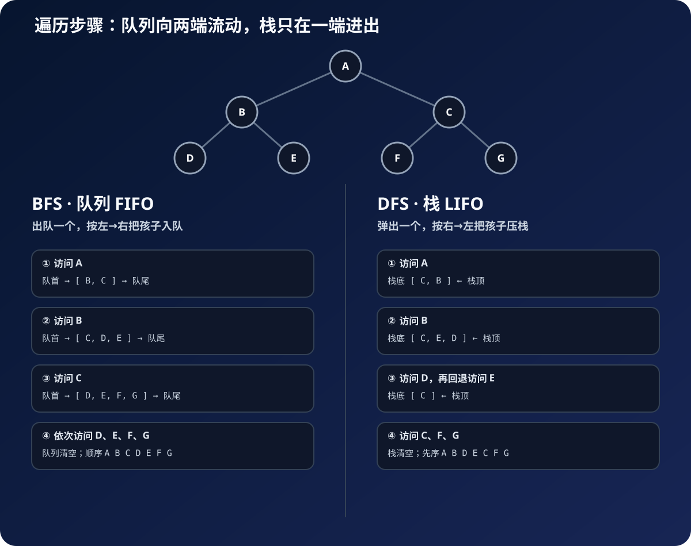

学习二叉树遍历时，我们经常直接记住两组搭配：

- 广度优先遍历（BFS）使用**队列**；
- 深度优先遍历（DFS）使用**栈**。

但真正应该记住的不是结论，而是一个问题：**当前节点访问完以后，下一步应该轮到谁？**

遍历过程中，我们需要暂存“已经发现、但还没有访问”的节点。队列和栈都能存节点，选择它们的关键并不是存储能力，而是它们能否按照遍历所需的顺序取出下一个节点：

- BFS 要保证离根更近、发现更早的节点优先；
- DFS 要保证刚发现的更深节点优先。

所以，队列和栈实际上是两种不同的“下一节点调度规则”。

本文使用同一棵二叉树进行演示：

```text
        A
      /   \
     B     C
    / \   / \
   D   E F   G
```

## 一、广度优先：先发现的节点，应该先访问

广度优先遍历要一层一层地访问：先访问根节点 A，再访问第二层 B、C，最后访问第三层 D、E、F、G。

```text
A → B → C → D → E → F → G
```

访问 A 时，我们发现了 B 和 C。既然 B 先被发现，它就应该先被访问；访问 B 后，新发现的 D、E 不能插到 C 前面，而应该排到 C 后面。

这正是队列的规则：**先进先出（FIFO，First In First Out）**。

### 为什么必须保持“先进先出”？

节点被发现的先后顺序，也代表它们与根节点距离的远近。访问 A 时发现的 B、C 距离根节点为 1；访问 B 时发现的 D、E 距离根节点为 2。

为了实现“先访问距离为 1 的节点，再访问距离为 2 的节点”，旧节点必须排在新节点前面：

```text
访问 A 后：等待访问 [B, C]
访问 B 后：C 已经在等待，D、E 刚刚被发现

正确顺序：[C, D, E]
```

队列恰好保证旧节点从队首先出去，新节点只能从队尾加入。因此只要上一层还有节点没有访问，下一层的节点就不可能抢到它们前面。

如果 BFS 改用栈，访问 B 后会得到类似 `[C, E, D]` 的待访问状态。D 位于栈顶，会在 C 之前被取出，遍历会直接进入下一层：

```text
A → B → D → E → C ...
```

这已经不是“逐层访问”，而变成了深度优先。因此，BFS 选择队列不是习惯写法，而是由“同一层必须在下一层之前完成”这个目标决定的。



把队列想成排队买票：新来的节点站到队尾，下一次总是从队首取节点。于是，同一层较早发现的节点会先访问，下一层节点则自然排在当前层后面。

### BFS 的 JavaScript 实现

```javascript
function bfs(root) {
  if (!root) return [];

  const queue = [root];
  const result = [];

  while (queue.length > 0) {
    const node = queue.shift(); // 1. 队首出队
    console.log(`正在访问：${node.value}`);

    result.push(node.value);

    // 2. 当前节点的孩子从队尾入队
    if (node.left) queue.push(node.left);
    if (node.right) queue.push(node.right);

    // map 只用于把节点转换成方便观察的值
    console.log("等待队列：", queue.map(item => item.value));
    console.log("遍历结果：", [...result]);
    console.log("----------------");
  }

  return result;
}

// 构造文章开头展示的二叉树
const tree = {
  value: "A",
  left: {
    value: "B",
    left: { value: "D", left: null, right: null },
    right: { value: "E", left: null, right: null },
  },
  right: {
    value: "C",
    left: { value: "F", left: null, right: null },
    right: { value: "G", left: null, right: null },
  },
};

const result = bfs(tree);
console.log("最终结果：", result);
```

运行代码后，控制台会依次输出：

```text
正在访问：A
等待队列： [B, C]
遍历结果： [A]
----------------
正在访问：B
等待队列： [C, D, E]
遍历结果： [A, B]
----------------
正在访问：C
等待队列： [D, E, F, G]
遍历结果： [A, B, C]
----------------
正在访问：D
等待队列： [E, F, G]
遍历结果： [A, B, C, D]
----------------
正在访问：E
等待队列： [F, G]
遍历结果： [A, B, C, D, E]
----------------
正在访问：F
等待队列： [G]
遍历结果： [A, B, C, D, E, F]
----------------
正在访问：G
等待队列： []
遍历结果： [A, B, C, D, E, F, G]
----------------
最终结果： [A, B, C, D, E, F, G]
```

观察每一轮的“等待队列”就能发现：代码总是从左边取出节点，再把新发现的孩子放到右边，所以节点会按照 `A → B → C → D → E → F → G` 的顺序逐层访问。

队列里保存的不是“已经访问过的节点”，而是**已经发现、等待访问的节点**。只要始终从队首取、从队尾放，访问顺序就会按层展开。

> JavaScript 数组的 `shift()` 会移动其余元素。在数据量很大时，可以用索引模拟队首，避免频繁移动数组。

```javascript
function bfsWithIndex(root) {
  if (!root) return [];

  const queue = [root];
  const result = [];
  let front = 0;

  while (front < queue.length) {
    const node = queue[front++];
    result.push(node.value);
    if (node.left) queue.push(node.left);
    if (node.right) queue.push(node.right);
  }

  return result;
}
```

## 二、深度优先：最后发现的分支，应该先继续

深度优先遍历会沿着一条路径不断向下，走不动时再回退。以前序遍历为例，顺序是：

```text
A → B → D → E → C → F → G
```

访问 A 后，我们知道以后还要访问 C，但现在要先深入 B；访问 B 后，又要先深入 D。也就是说，越晚出现的“待处理分支”，越应该先处理。

这正是栈的规则：**后进先出（LIFO，Last In First Out）**。

### 为什么必须保持“后进先出”？

DFS 的目标是沿当前路径一直向下。访问 A 时，B、C 都是待访问节点；选择 B 后发现 D、E，此时 D、E 比 C 更靠近当前正在探索的路径。

如果要继续向深处走，新发现的 D、E 就必须比早已等待的 C 更先处理：

```text
C：较早发现，留到 B 的整棵子树结束后再处理
D：刚刚发现，是当前路径的下一步

下一步必须选择 D，而不是 C
```

栈会把最新发现的节点放在栈顶，让它最先被弹出。这样算法会不断处理当前节点的孩子；走到叶子节点、没有新孩子可以压栈时，栈才会弹出之前暂存的兄弟节点，实现“走到底再回退”。

如果 DFS 改用队列，较早进入的 C 会排在新发现的 D、E 前面，访问顺序变成：

```text
A → B → C → D → E ...
```

算法还没有深入 B 的下一层就转去访问 C，结果自然变成广度优先。因此，DFS 使用栈，是因为“当前路径上最新发现的节点必须优先”正好对应后进先出。

把栈想成一摞盘子：最后放上去的盘子最先拿走。为了让左孩子先访问，迭代写法要先压入右孩子、再压入左孩子，这样左孩子才会位于栈顶。

### DFS 的迭代实现

```javascript
function dfs(root) {
  if (!root) return [];

  const stack = [root];
  const result = [];

  while (stack.length > 0) {
    const node = stack.pop(); // 1. 从数组右侧弹出栈顶节点
    console.log(`正在访问：${node.value}`);

    result.push(node.value);

    // 2. 先右后左：左孩子后入栈，因此先出栈
    if (node.right) stack.push(node.right);
    if (node.left) stack.push(node.left);

    console.log(
      "等待栈（左边是栈底，右边是栈顶）：",
      stack.map(item => item.value),
    );
    console.log("遍历结果：", [...result]);
    console.log("----------------");
  }

  return result;
}

// 使用 BFS 示例中构造的 tree
const dfsResult = dfs(tree);
console.log("DFS 最终结果：", dfsResult);
```

运行代码后，控制台会依次输出：

```text
正在访问：A
等待栈（左边是栈底，右边是栈顶）： [C, B]
遍历结果： [A]
----------------
正在访问：B
等待栈（左边是栈底，右边是栈顶）： [C, E, D]
遍历结果： [A, B]
----------------
正在访问：D
等待栈（左边是栈底，右边是栈顶）： [C, E]
遍历结果： [A, B, D]
----------------
正在访问：E
等待栈（左边是栈底，右边是栈顶）： [C]
遍历结果： [A, B, D, E]
----------------
正在访问：C
等待栈（左边是栈底，右边是栈顶）： [G, F]
遍历结果： [A, B, D, E, C]
----------------
正在访问：F
等待栈（左边是栈底，右边是栈顶）： [G]
遍历结果： [A, B, D, E, C, F]
----------------
正在访问：G
等待栈（左边是栈底，右边是栈顶）： []
遍历结果： [A, B, D, E, C, F, G]
----------------
DFS 最终结果： [A, B, D, E, C, F, G]
```

注意数组的右边代表栈顶。访问 A 后，代码先把 C 压栈，再把 B 压栈，得到 `[C, B]`；下一轮 `pop()` 会从右边弹出 B，所以遍历会先沿着左子树继续深入。

## 三、递归 DFS 的“栈”藏在哪里？

递归代码里看不到 `stack`，但栈并没有消失。每调用一次 `dfs`，运行时都会把函数参数、局部变量和返回位置保存到**调用栈**中。

```javascript
function preorder(node, result = []) {
  if (!node) return result;

  result.push(node.value);
  preorder(node.left, result);
  preorder(node.right, result);
  return result;
}
```

执行到 D 时，调用栈大致是：

```text
栈顶  preorder(D)
      preorder(B)
栈底  preorder(A)
```

D 执行结束后弹栈，程序回到 B；B 的左子树结束后再进入 E。递归天然遵循“最后进入的函数最先返回”，所以递归 DFS 本质上仍然依赖栈。

## 四、队列和栈决定的是“待访问节点”的顺序

两种遍历的主体其实非常相似：

1. 取出一个待访问节点；
2. 处理这个节点；
3. 把它的孩子加入待访问集合；
4. 重复直到集合为空。

真正的区别只有“怎样取出下一个节点”：

| 遍历方式 | 待访问结构 | 取出规则 | 形成的效果 |
| --- | --- | --- | --- |
| BFS | 队列 | 先进先出 | 旧节点先处理，逐层扩散 |
| DFS | 栈 | 后进先出 | 新分支先处理，一路深入 |

因此，不是因为二叉树规定 BFS 必须写 `queue`、DFS 必须写 `stack`，而是因为这两种数据结构恰好表达了两种遍历对“下一步”的要求。

## 五、复杂度与使用场景

假设二叉树共有 `n` 个节点：

- BFS 和 DFS 都会访问每个节点一次，时间复杂度都是 `O(n)`；
- BFS 的空间取决于树最宽的一层，最坏为 `O(n)`；
- DFS 的空间取决于树的高度 `h`，为 `O(h)`，极端退化时也可能达到 `O(n)`。

选择时可以这样判断：

- 要找离根最近的节点、求最短层数、做层序统计：优先 BFS；
- 要遍历完整路径、回溯、判断子树结构：优先 DFS。

## 六、最后记住一句话

> **广度优先要让先发现的节点先访问，所以用队列；深度优先要让后发现的分支先继续，所以用栈。**

当你不再死记“BFS 配队列、DFS 配栈”，而是观察“下一步应该轮到谁”，这两个搭配就会变得非常自然。
