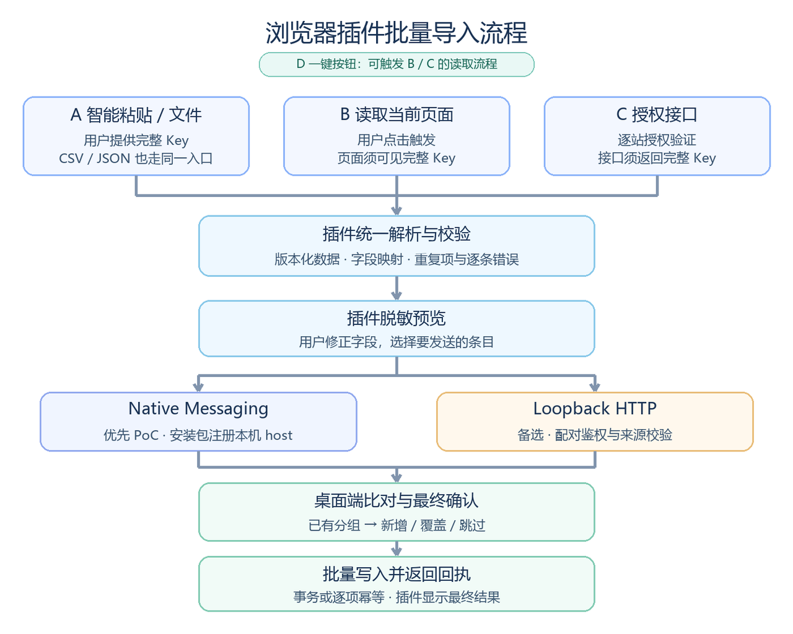
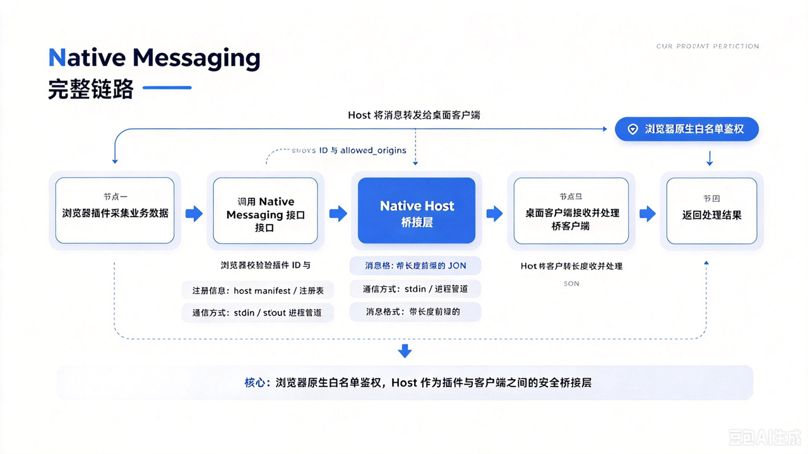
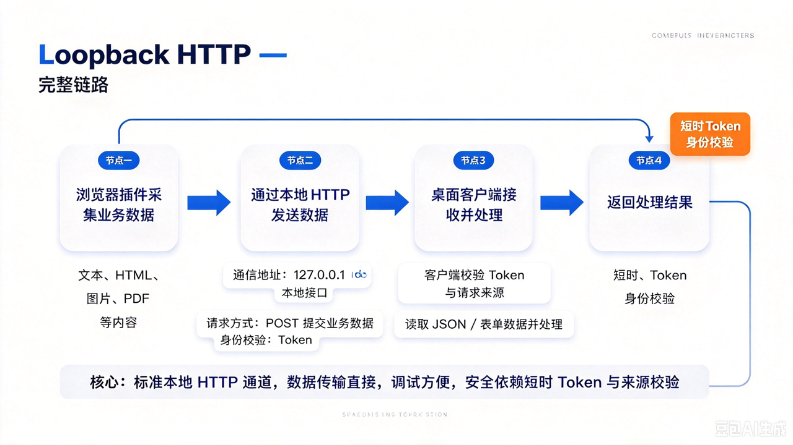
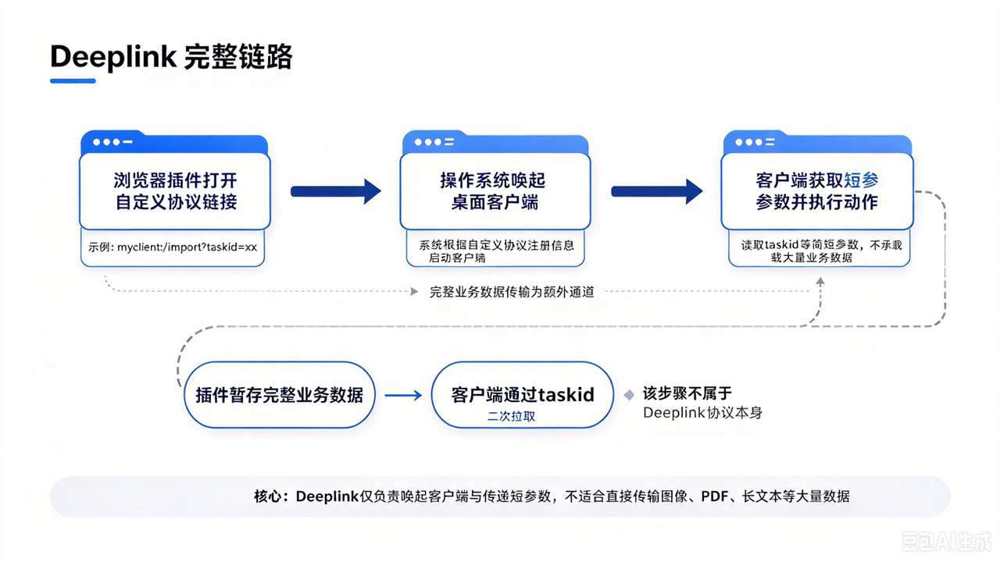

中转站桌面端按分组保存上游渠道的 Base URL 与 API Key。用户从多个渠道取得配置后，需要反复切换窗口、逐组录入，容易填错地址、密钥和目标分组。本项目明确交付 Chrome／Edge 浏览器插件：在浏览器内收集、整理、预览多条配置，再一键交给中转站桌面端确认并批量写入。

插件不是桌面端导入页的附属入口。本文是落地前的技术调研，要回答两个独立问题：

1. **插件如何从不同来源取得完整配置**（采集层）；
2. **插件怎样把含密钥的数据可靠送到桌面端**（通信层）。

两层可以组合，不能把某一种来源方式或通信方式写成唯一流程。

## 一、共同主干

四条来源路径最终汇入同一条主干：插件承担浏览器侧的收集与整理，桌面端承担最终的冲突判断与持久化。

> 用户在插件中选择来源 → 插件映射统一格式并校验 → 插件脱敏预览 → 发送到桌面端 → 桌面端比对已有分组、让用户决定新增／覆盖／跳过 → 写入并返回逐项结果。

四条路径最终使用同一数据结构、预览页和桌面写入流程；新增站点只实现“来源适配器”，不重写导入链路。

## 二、通信层：插件 → 客户端的三种路径

调研覆盖三种独立的通信方式，按数据通道是否“能直接传完整 JSON”分为三类。

### 1. Native Messaging（原生消息）

浏览器原生提供的与本地程序通信能力。浏览器通过进程管道直接与一个 Native Host 可执行程序双向收发 JSON。

**核心特点**：双向直接传完整 JSON；浏览器侧做插件白名单鉴权；不需要端口；Host 进程按需拉起。

### 2. Loopback HTTP（本地回环 HTTP）

桌面客户端在本机 `127.0.0.1` 开启 HTTP 服务，插件以普通 HTTP 请求与其通信。

**核心特点**：客户端常驻后台，服务持续监听，不随单次请求关闭；结果通过 `taskId` 轮询获取。

### 3. Deeplink（自定义协议唤起）

Deeplink 只负责“唤起程序 + 传递短 ID”，不承担主数据通道。大量网页数据需通过反向请求拉取。

**核心特点**：只能传短 ID，传不了大量网页数据；客户端拿到 `taskId` 后反向去和插件通信（一般用本地 `127.0.0.1` 简易接口）取回完整数据；这一步正是 CCSwitch 的核心逻辑。

### 4. 三种路径对比

| 维度 | Native Messaging | Loopback HTTP | Deeplink |
| --- | --- | --- | --- |
| 数据通道 | 双向管道，直接传完整 JSON | 本地 HTTP，传完整 JSON | 只传短 ID，需反向拉取 |
| 是否需要端口 | 否 | 是（127.0.0.1） | 否（反向拉取时仍需端口） |
| 鉴权 | 浏览器插件白名单 | 短时 Token + 来源校验 | 协议唤起 + 反向接口鉴权 |
| 进程生命周期 | Host 按需拉起，断开即退出 | 客户端常驻，服务持续监听 | 客户端按需唤起 |
| 结果获取 | 同步原路返回 | taskId 轮询 | 反向接口轮询 |
| 适配主数据通道 | ✅ 推荐 | ⚠️ 调试期备选 | ❌ 仅附加唤起能力 |

> **优先主推 Native Messaging；开发调试期备选 Loopback HTTP；Deeplink 只作为附加唤起能力，不做主数据通道。**

## 三、技术栈选型

围绕“MV3 插件 + Native Messaging + 桌面端”三条线选型，优先复用成熟框架与官方示例，不重复造轮子。

| 层 | 选型 | 说明 |
| --- | --- | --- |
| 插件框架 | **WXT** | 原生支持 MV3 项目结构、content script、background 与构建 |
| 通信主通道 | **Chrome Native Messaging** | 浏览器原生能力，无需端口，按需拉起 Host |
| 桌面端转发 | **命名管道 / IPC** | Native Host 与常驻主客户端之间转发 |
| 调试期备选 | **127.0.0.1 + 短时 Token** | 不依赖 Host 安装，便于联调 |
| 附加唤起 | **自定义协议 deeplink** | 仅唤起程序 + 传短 ID |
| 浏览器适配 | **Chrome + Edge 双注册** | 注意 Edge host 注册与扩展 ID 规则差异 |

## 四、竞品参考：CodexSwitch

CodexSwitch 是同类需求的现成方案，可直接对照其唤起与导入逻辑。

- GitHub：`https://github.com/H1d3rOne/CodexSwitch`
- 介绍文档：CodexSwitch 介绍文档

## 五、可参考的开源代码

- **CC Switch 源码与导入逻辑**：`https://github.com/farion1231/cc-switch`
  - Deep Link 官方说明：`https://github.com/farion1231/cc-switch/blob/main/docs/user-manual/en/2-providers/2.1-add.md`
  - 重点看：导入确认、预览和桌面端写入，**不直接复制含 Key 的链接传输**。
- **WXT 与示例**：`https://github.com/wxt-dev/wxt`、`https://github.com/wxt-dev/wxt-examples`
  - 重点看：MV3 项目结构、content script、后台和构建。
- **Chrome Native Messaging 文档与示例仓库**：
  - 文档：`https://developer.chrome.com/docs/extensions/develop/concepts/native-messaging`
  - 示例：`https://github.com/GoogleChrome/chrome-extensions-samples`
  - 注意：旧仓库里的 Native Messaging 示例属于 **MV2**，扩展端应按 **MV3** 实现。
- **Edge host 注册与扩展 ID 规则**：`https://learn.microsoft.com/en-us/microsoft-edge/extensions/developer-guide/native-messaging`

## 六、验证顺序与安全边界

验证按从“来源稳定”到“来源需授权”的顺序推进，先打通可控路径，再逐步外探。

| 阶段 | 来源 | 重点验证 |
| --- | --- | --- |
| A | 多条粘贴／文件导入 | 字段映射、逐项错误、脱敏预览、桌面确认、批量写入和回执 |
| B | 目标站点 | Key 是否完整可见、需要何种权限、页面改版风险 |
| C | 稳定且授权的接口 | 仅当来源提供稳定且授权的接口时才做 |
| D | 页面按钮体验 | 最后测试页面按钮体验 |

**先用真实样例打通 A，再用目标站点打通 B；只有来源提供稳定且授权的接口时才做 C；最后测试 D。**

### 安全边界

- API Key 仅在插件导入会话和本机通道中短暂存在，不进入 URL、浏览器持久存储、日志或无关云服务。
- 插件按站点申请最小权限；页面只显示掩码时退回 A，不绕过来源限制。

### 验收指标

验收看的是端到端的可靠性与泄露面，而不只看按钮能否点通：

- 批量导入耗时
- 字段错误率
- 重复项处理
- 安装成功率
- 失败重试
- 密钥泄露面
