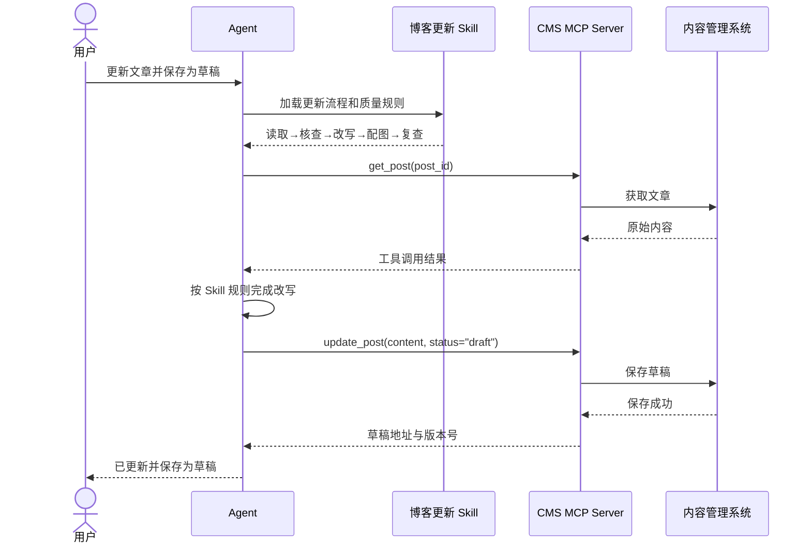

你可能听过下面三种说法：

- Function Calling 让模型“调用工具”；
- MCP 让模型“连接工具和数据”；
- Skill 也能让模型“完成一项任务”。

听上去，它们似乎都在解决同一件事：**让 AI 不只回答问题，还能真正做事。**

但如果把三者当成同类技术，就很容易陷入错误的比较。它们关注的并不是同一个问题，而是处在不同的抽象层：

> **Function Calling 解决“一次调用怎么发生”，MCP 解决“工具怎么接进来”，Skill 解决“一整件事应该怎么做”。**

这篇文章不堆定义。我们用一个贯穿全文的任务——“更新一篇博客并保存为草稿”——把三者彻底拆开，再重新组合起来。

## 一、先看全景：三者不在同一个抽象层

| 概念 | 核心问题 | 典型内容 | 更像什么 |
| --- | --- | --- | --- |
| **Skill** | 这类任务应该如何完成？ | 指令、步骤、模板、检查规则、脚本 | 操作手册 |
| **MCP** | 外部系统如何统一接入？ | 工具、资源、能力发现、鉴权与通信 | USB / 插座标准 |
| **Function Calling** | 模型如何请求执行一个具体操作？ | 函数名、参数 Schema、调用结果 | 按下某个按钮 |

下面这张图比“三个重叠的圆”更准确：三者不是互斥方案，而是经常一起出现的三层结构。

```mermaid
flowchart TB
    U["用户目标<br/>更新并发布一篇博客"]
    S["Skill：任务方法层<br/>步骤、规范、模板、检查规则"]
    A["Agent / 模型<br/>判断下一步该做什么"]
    FC["Function Calling：调用机制<br/>选择工具 + 生成结构化参数"]
    MCP["MCP：标准连接层<br/>发现和连接外部能力"]
    L["应用内函数<br/>检查链接 / 渲染 Markdown"]
    CMS["CMS MCP Server<br/>读取、更新、发布文章"]
    DAM["素材库 MCP Server<br/>搜索、上传图片"]
    ANA["分析平台 MCP Server<br/>读取文章数据"]

    U --> S
    S --> A
    A --> FC
    FC --> L
    FC --> MCP
    MCP --> CMS
    MCP --> DAM
    MCP --> ANA

    classDef skill fill:#7c3aed,color:#fff,stroke:#5b21b6
    classDef mcp fill:#0f766e,color:#fff,stroke:#115e59
    classDef call fill:#ea580c,color:#fff,stroke:#c2410c
    class S skill
    class MCP mcp
    class FC call
```

*Skill 位于任务编排层；Function Calling 位于单次调用层；MCP 位于外部能力的标准连接层。*

## 二、Function Calling：模型发出的结构化调用请求

Function Calling（也常叫 Tool Calling）是一种让模型请求外部能力的机制。基本流程是：

1. 应用把可用函数及参数结构告诉模型；
2. 模型判断当前任务是否需要调用函数；
3. 模型返回函数名和结构化参数；
4. 应用或工具运行环境真正执行函数；
5. 执行结果返回模型，模型再继续回答或决定下一步。

例如，模型可能返回这样一次调用请求：

```json
{
  "name": "update_blog_post",
  "arguments": {
    "post_id": "agent-tools-101",
    "title": "Skill、MCP 与 Function Calling",
    "status": "draft"
  }
}
```

最常见的误区是：**模型输出了这段 JSON，不等于博客已经更新。**

它只是在说：“我希望调用 `update_blog_post`，参数是这些。”真正的权限检查、API 请求、重试、回滚和错误处理，仍然由外部程序负责。模型提出请求，执行环境决定是否以及如何执行。

OpenAI 官方文档也将 Function Calling 称为 Tool Calling，并把它描述为模型连接应用所提供数据与动作的方式。完整流程可参考 [OpenAI Function Calling 文档](https://developers.openai.com/api/docs/guides/function-calling)。

## 三、MCP：让外部能力以统一方式被发现和连接

如果说 Function Calling 关心的是“这一次要调用哪个工具、传什么参数”，那么 MCP（Model Context Protocol）更关心：**这些外部工具和上下文能力是怎样接入 AI 客户端的？**

它通常处理这些问题：

- AI 客户端怎样发现服务提供的能力；
- 工具、资源和上下文怎样被描述；
- 请求与结果怎样传输；
- 身份认证与权限怎样衔接；
- 同一套服务怎样被不同 Agent 或客户端复用。

一个 CMS MCP Server 可能暴露下面这些能力：

```text
CMS MCP Server
├── Tools
│   ├── search_posts
│   ├── get_post
│   ├── update_post
│   ├── upload_image
│   └── publish_post
└── Resources
    ├── brand_guidelines
    ├── editorial_calendar
    └── category_definitions
```

这样，CMS 不必为每一个 AI 客户端重新设计一套专用接入方式。客户端连接 MCP Server 后，就能发现它提供的工具和上下文，再把合适的能力交给模型使用。

需要注意：**MCP 不等于某一个函数。** 一个 MCP Server 可以提供多个工具，也可以提供资源等其他上下文能力。OpenAI 的 Responses API 可以连接远程 MCP Server，并把其中的能力提供给模型使用，详见 [OpenAI MCP 与 Connectors 文档](https://developers.openai.com/api/docs/guides/tools-connectors-mcp)。

## 四、Skill：把经验封装成可复用的工作方法

Skill 既不是一个函数，也不只是 API 描述。它更像一份能被 Agent 按需加载的专业操作手册，通常会说明：

- 什么时候应该使用它；
- 任务应该按什么顺序执行；
- 需要读取哪些资料；
- 可以调用哪些工具；
- 必须遵守哪些约束；
- 怎样检查结果；
- 失败时怎样处理。

以“博客更新 Skill”为例，它可能规定：

```text
1. 读取原文、目标读者和编辑规范
2. 检查可能过时的事实
3. 生成修改提纲
4. 保留原有观点与语气
5. 更新正文
6. 生成关系图与摘要
7. 执行链接、事实和格式检查
8. 保存为草稿，不直接发布
```

它回答的不是“怎样调用 `update_post`”，而是：**一篇博客应该按照什么流程更新，怎样才算完成得好。**

因此，一个 Skill 可以使用多个工具，也可以完全不调用工具。纯写作、代码审查或本地文件整理等 Skill，可能只包含阅读、推理、编辑与验证。OpenAI 对 Skills 的说明同样强调可复用工作流，以及将指令、资源和脚本组织起来并按需加载，参见 [OpenAI Skills 文档](https://learn.chatgpt.com/docs/build-skills)。

## 五、用一次博客更新，把三者串起来

现在，用户提出一个具体目标：

> 更新《AI Agent 工具生态》这篇博客，补充 Skill、MCP 和 Function Calling，并保存为草稿。

Agent 的完整工作过程可能是：

1. 匹配并加载“博客更新工作流” Skill；
2. Skill 要求先读取原文和编辑规范；
3. Agent 通过 CMS MCP Server 发现 `get_post`；
4. 模型发起一次工具调用，读取文章；
5. Agent 按 Skill 中的规则分析和改写；
6. 模型调用 `upload_image` 上传关系图；
7. 模型调用 `update_post`，把文章保存为草稿；
8. Skill 要求继续执行链接与格式复查；
9. Agent 报告结果，但不自动发布。



这段流程展示了三者真正的关系：

- **MCP** 决定怎样连接 CMS，并让能力可被发现；
- **Function Calling** 表现为 `get_post`、`upload_image`、`update_post` 等一次次具体调用；
- **Skill** 规定整件事的顺序、边界和质量标准。

换句话说，Function Calling 本身并不知道什么叫“高质量的博客更新”。它只负责表达一次具体的工具调用请求。

## 六、它们没有简单的一一包含关系

理解三者时，还要避开“谁包含谁”的思维陷阱。

### 1. Function Calling 不一定需要 MCP

应用可以直接把本地函数定义和参数 Schema 提供给模型。只有几个应用内函数时，引入 MCP 未必必要。

### 2. MCP 不只等于 Function Calling

一个 MCP Server 可以暴露多个工具，还可以提供资源等上下文能力。它解决的是标准化接入，而不是某一次调用的业务逻辑。

### 3. Skill 不一定需要 MCP

如果任务只涉及本地文件、已有上下文或纯文本处理，Skill 可以完全不连接远程服务。

### 4. Skill 也不一定每一步都调用函数

很多步骤只是阅读、推理、写作和验证。工具调用只是完成工作流的一种手段，而不是工作流本身。

因此，更准确的总结是：

> **Function Calling 可以独立使用；MCP 可以为它提供标准化的工具来源；Skill 可以在更高层组织这些调用。**

## 七、到底应该怎么选？

```mermaid
flowchart TD
    Q1{"是否只需调用<br/>应用内的少量函数？"}
    Q2{"能力是否需要被多个<br/>Agent 或客户端复用？"}
    Q3{"任务是否有稳定、重复的<br/>步骤和质量规则？"}
    F["Function Calling"]
    M["MCP + 工具调用"]
    S["Skill"]
    ALL["Skill + MCP + Function Calling"]

    Q1 -- "是" --> F
    Q1 -- "否" --> Q2
    Q2 -- "是" --> Q3
    Q2 -- "否" --> S
    Q3 -- "否" --> M
    Q3 -- "是" --> ALL

    classDef skill fill:#7c3aed,color:#fff,stroke:#5b21b6
    classDef mcp fill:#0f766e,color:#fff,stroke:#115e59
    classDef call fill:#ea580c,color:#fff,stroke:#c2410c
    class S skill
    class M mcp
    class F call
    class ALL skill
```

也可以直接按下面四条判断：

- **只需要模型调用几个应用内函数**：使用 Function Calling；
- **希望同一套工具被多个 Agent 或客户端复用**：考虑 MCP；
- **某类任务反复出现，并且有稳定步骤和质量标准**：封装成 Skill；
- **希望 AI 稳定完成跨系统的复杂任务**：组合使用 Skill + MCP + Function Calling。

当然，现实系统不会永远落在流程图的单一路径上。例如，一个重复任务即使只调用少量本地函数，也同样值得封装成 Skill。选择的关键不是追求“技术全家桶”，而是先确认你真正缺的是**调用机制、连接标准，还是工作方法**。

## 八、最后再记一次

如果只记住一句话，就记住这句：

> **Function Calling 给 Agent 一双“手”，MCP 统一“插座”，Skill 则告诉它先做什么、后做什么，以及怎样才算做好。**

三者不是竞争关系。一个成熟的 Agent，往往正是用 Skill 沉淀方法，用 MCP 接入外部世界，再通过一次次 Function Calling 把计划变成行动。
